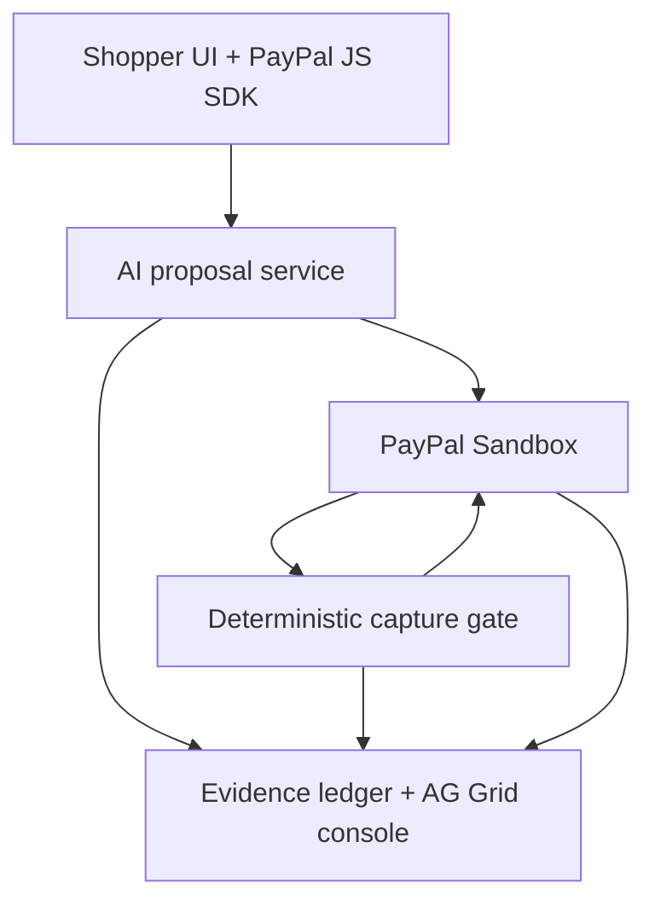
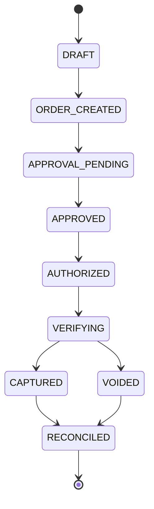

# Second Look — Claude Build Specification

**Version:** 1.0  
**Date:** October 2026  
**Hackathon:** PayPal AI Hackathon 2026  
**Product name:** Second Look  
**Tagline:** Catch the mismatch before money moves.

> This is the authoritative implementation brief for building Second Look. Read it before changing the repository. The product is deliberately narrow: an AI-commerce payment capture gate built on the PayPal Sandbox. Do not broaden the scope until the Phase 0 acceptance criteria pass.

---

## 1. Product in one paragraph

Second Look is a safety and evidence layer for AI shopping agents. The agent may recommend a purchase and prepare a PayPal order, but it never decides whether money moves. After the sandbox buyer approves the order and PayPal authorizes it, Second Look independently fetches the order from PayPal, compares the payable facts against the shopper's original intent, the merchant catalog, and policy, and then makes one deterministic decision: capture or void. Every assertion, decision, PayPal response, and webhook is stored in an evidence ledger that a human can inspect in an AG Grid-powered console.

The central demo is a controlled mismatch: the agent says one thing, the PayPal order contains another, and Second Look blocks capture and voids the authorization. A corrected attempt passes the same gate and is captured. This is not escrow, fraud scoring, or a claim that PayPal holds funds in trust. It is a post-authorization, pre-capture control around PayPal's normal Sandbox lifecycle.

## 2. Non-negotiable product decisions

These decisions are authoritative. If an implementation idea conflicts with them, keep the decision and ask before changing it.

| Decision | Required interpretation |
|---|---|
| Payment rail | PayPal Sandbox is the actual payment execution rail in the demo. |
| AI role | AI proposes an order and explains its reasoning. AI cannot call capture or void. |
| Final decision | Deterministic server-side code decides `CAPTURE` or `VOID`. |
| Verification | The capture gate calls PayPal `GET /v2/checkout/orders/{id}` itself. It never trusts caller-supplied amounts or item data. |
| Buyer approval | Manual PayPal Sandbox approval is the primary path. Use PayPal JS SDK Buttons with `intent=authorize`; keep redirect handling as a fallback. |
| Gate location | The gate is an internal backend module. Do not expose a public endpoint that directly triggers capture or void. |
| Evidence | Persist the intent contract, fresh PayPal order snapshot, assertions, decision, immediate API response, idempotency keys, and webhook evidence. |
| Environment | Sandbox only. Never request, store, or use production credentials. |
| Hosted demo | Render + Postgres is the intended deployment shape. Do not rely on SQLite's local disk in a hosted demo. |
| Primary sponsor | PayPal + AG Grid. AG Grid is the main sponsor-prize target. |
| Secondary tools | Render for hosting and Postman for a reproducible collection. Use Channel3, APIMatic, KERNEL, AG Studio/MCP, or other sponsors only if their use is real and does not delay the core. |
| Scope boundary | No escrow, disputes, refunds, invoice/MCP dependency, web3, marketplace, generic fraud score, or production checkout in the MVP. |

## 3. The problem

AI shopping agents are good at interpreting natural language, comparing products, and assembling a checkout. They are not a sufficient last-mile control for money movement. An agent can misread a quantity, select the wrong variant, apply a stale price, or be manipulated by catalog text. If the agent can immediately capture payment, a small reasoning error becomes a financial event.

Existing checkout systems usually validate a transaction against payment rules, not against the user's original intent. Second Look introduces an explicit, inspectable boundary:

> Authorization means PayPal has reserved the ability to pay. Capture means the system has independently proved that the payable order still matches the intent.

The first customer is a platform that lets agents transact for people or businesses. The first user is a shopper or finance operator who wants an answer to a simple question: “What exactly is about to move through PayPal, and why is it safe to capture?”

## 4. Product thesis and market position

Second Look is not another shopping assistant. It is the control plane between an AI proposal and payment capture.

### Target users

1. **AI commerce platform builders** — need a reusable approval and verification boundary before agents can spend.
2. **SMBs and finance operators** — need a record proving why an agent payment was allowed or blocked.
3. **Marketplaces and merchant platforms** — need deterministic policy checks without replacing their payment processor.
4. **Developers evaluating agentic commerce** — need a concrete, testable reference architecture rather than a chatbot demo.

### Differentiation

- The AI can be wrong without being allowed to move money.
- PayPal is not decorative; order creation, authorization, fresh re-fetch, capture, void, and webhooks are all in the core path.
- The product produces evidence, not just a green/red score.
- A controlled mismatch is visible and reproducible in a short demo.
- The same gate can protect a live adapter and run a regression suite of saved traces.

### What the product is not

- Not an escrow service. PayPal's terms and product semantics remain unchanged.
- Not a fraud detector. It checks contract and policy consistency, not identity risk or chargeback probability.
- Not an LLM judge. AI can explain; deterministic checks own the payment decision.
- Not a replacement for PayPal. PayPal remains the payment rail and source of payment state.

## 5. Core user journey

1. The shopper asks: “Buy the black travel backpack, 1 unit, under $90 delivered.”
2. The AI shopping agent searches the test catalog and proposes an item, quantity, shipping, currency, and total.
3. Second Look freezes the proposal as an **intent contract** with a hash and run ID.
4. The server creates a PayPal Sandbox order with `intent: AUTHORIZE` and links the run through `purchase_units[].custom_id`.
5. The shopper approves the order in the PayPal Sandbox popup.
6. The server authorizes the order and stores the authorization ID from the authorize response.
7. The internal capture gate fetches the order directly from PayPal and evaluates it against the frozen contract, catalog snapshot, and policy.
8. If every required assertion passes, Second Look captures the authorization.
9. If any required assertion fails, Second Look voids the authorization and shows the exact evidence that caused the block.
10. PayPal webhooks reconcile the result asynchronously. The judge can inspect the full audit trail in the evidence console.

## 6. Reference architecture



### Component responsibilities

| Component | Owns | Must not own |
|---|---|---|
| Shopper UI | Request input, proposal review, PayPal Buttons, evidence display | Secrets, capture/void decisions |
| AI proposal service | Interpret request, select catalog item, produce structured proposal and explanation | Direct PayPal capture/void, final payment decision |
| Intent store | Immutable contract for the run, policy snapshot, catalog snapshot, contract hash | Fresh PayPal truth |
| PayPal adapter | OAuth token, order create, order fetch, authorize, capture, void, webhook verification | Business policy decisions |
| Capture gate | Fresh fetch, deterministic assertions, decision, idempotent action | Trusting client payloads, browser-triggered payment actions |
| Evidence ledger | Immutable-ish event records and snapshots | Replacing PayPal as system of record for payment state |
| AG Grid console | Explore runs, assertions, traces, and webhook events | Issuing payment actions |

## 7. Correct PayPal flow

This is the flow to implement and to show in the README and demo. PayPal does not return an “approved order” to the server after buyer approval; the browser callback returns the order ID, and the server then authorizes it.

```mermaid
sequenceDiagram
    participant U as Shopper / Sandbox buyer
    participant A as Second Look API
    participant P as PayPal Sandbox
    participant G as Internal capture gate
    participant L as Evidence ledger

    U->>A: Shopper request
    A->>A: Agent proposes order; store intent contract
    A->>P: POST /v2/checkout/orders (AUTHORIZE, custom_id)
    P-->>A: Order ID + approval URL
    A->>U: Render PayPal Buttons
    U->>P: Log in and approve
    P-->>U: onApprove(orderID)
    U->>A: Send orderID to backend
    A->>P: POST /v2/checkout/orders/{id}/authorize
    P-->>A: Authorization ID
    A->>L: Store authorization ID
    A->>G: Internal evaluate(run_id)
    G->>P: GET /v2/checkout/orders/{id}
    P-->>G: Fresh PayPal order
    G->>G: Compare fresh order to intent, catalog, policy, custom_id
    G->>L: Store assertions and decision
    alt PASS
        G->>P: POST /v2/payments/authorizations/{id}/capture
    else BLOCK
        G->>P: POST /v2/payments/authorizations/{id}/void
    end
    P-->>A: Capture/void webhook
    A->>L: Store webhook evidence
```

### Exact PayPal facts to rely on

- Create the order with `intent: AUTHORIZE`.
- Return the PayPal order ID and approval URL to the browser.
- With PayPal JS SDK Buttons, `onApprove` receives `data.orderID`; send that ID to the backend.
- Authorize with `POST /v2/checkout/orders/{id}/authorize`.
- Store the authorization ID from `purchase_units[0].payments.authorizations[0].id`.
- The gate must independently call `GET /v2/checkout/orders/{id}` before deciding.
- Capture with `POST /v2/payments/authorizations/{authorization_id}/capture`.
- Void with `POST /v2/payments/authorizations/{authorization_id}/void`.
- Attach an idempotency key with `PayPal-Request-Id` to create, authorize, capture, and void calls.
- Verify and store relevant webhooks. Webhooks are reconciliation evidence, not a replacement for the immediate API response.

### Official references

- [PayPal AI Hackathon overview](https://paypalaihackathon.devpost.com/)
- [PayPal AI Hackathon rules](https://paypalaihackathon.devpost.com/rules)
- [PayPal REST API](https://developer.paypal.com/api/rest/)
- [Authorize and capture](https://developer.paypal.com/platforms/checkout/standard/customize/auth-capture/)
- [Authorize an order](https://developer.paypal.com/sdk/orders/v2/orders-authorize/)
- [Sandbox accounts](https://developer.paypal.com/sandbox-testing/accounts/)
- [Webhooks](https://developer.paypal.com/api/rest/webhooks/)
- [PayPal custom ID field](https://developer.paypal.com/docs/api/orders/v2/#definition-purchase_unit)

## 8. Intent contract

The intent contract is the frozen, machine-readable version of what the user authorized the agent to attempt. Store it before creating the PayPal order. Never mutate it after authorization; create a new run for a changed request.

```json
{
  "run_id": "run_01JSECONDLOOK",
  "request_text": "Buy one black travel backpack under $90 delivered",
  "currency": "USD",
  "max_total": "90.00",
  "items": [
    {
      "sku": "PACK-BLK-20L",
      "title": "20L travel backpack",
      "variant": "black",
      "quantity": 1,
      "max_unit_amount": "72.00"
    }
  ],
  "allowed_shipping": {
    "max_amount": "18.00",
    "countries": ["US"]
  },
  "policy": {
    "allow_substitutions": false,
    "require_catalog_sku": true,
    "require_currency_match": true
  },
  "catalog_snapshot_id": "catalog_2026_10_08_001",
  "policy_snapshot_id": "policy_default_v1",
  "contract_hash": "sha256:replace-with-real-hash"
}
```

### Contract rules

- Use decimal-safe money handling; do not compare currency values as binary floating point.
- The contract hash is a linkage and audit aid. It is not a security boundary by itself.
- The PayPal `custom_id` should contain a compact run reference and contract hash prefix, for example `sl:run_01JSECONDLOOK:h_91a2c4`.
- Do not put sensitive shopper data in `custom_id`.
- If a custom ID exceeds PayPal's allowed length, store a compact reference and verify the complete contract from the database.

## 9. Deterministic capture gate

The gate takes only a stored `run_id`, loads all server-side state, fetches PayPal state, evaluates assertions, persists the decision, and performs exactly one idempotent action.

### Gate algorithm

```text
evaluate(run_id):
  load run, frozen intent, catalog snapshot, policy snapshot
  assert run is AUTHORIZED and has authorization_id
  lock run or acquire a single-flight lease
  if a final decision already exists:
      return the stored decision without calling PayPal again
  fetch GET /v2/checkout/orders/{paypal_order_id} from PayPal
  normalize PayPal order into a comparison model
  run deterministic assertions
  persist fresh PayPal snapshot and all assertion results
  if every blocking assertion passes:
      POST capture with PayPal-Request-Id
      persist immediate response
      decision = CAPTURE
  else:
      POST void with PayPal-Request-Id
      persist immediate response
      decision = VOID
  return decision and evidence summary
```

### Required assertions

| Assertion ID | Comparison | Blocking? |
|---|---|---:|
| `amount.total` | PayPal order total equals the contract's allowed total | Yes |
| `amount.currency` | PayPal currency equals contract currency | Yes |
| `items.sku` | Every payable item maps to a catalog SKU | Yes |
| `items.variant` | PayPal item variant matches the requested variant | Yes |
| `items.quantity` | Quantity matches the requested quantity | Yes |
| `items.unit_amount` | Unit amount is within the contract's maximum | Yes |
| `shipping.amount` | Shipping is present and within the allowed maximum | Yes when specified |
| `policy.substitution` | No substitution when the contract disallows it | Yes |
| `link.custom_id` | PayPal custom ID links to this run and contract hash | Yes |
| `paypal.state` | Order and authorization are in the expected state | Yes |
| `freshness.snapshot` | The gate used a fresh PayPal GET, not browser data | Yes |
| `explanation` | AI explanation is coherent and complete | No; display only |

### Decision record example

```json
{
  "run_id": "run_01JSECONDLOOK",
  "decision": "VOID",
  "reason_codes": ["amount.total", "items.variant"],
  "assertions": [
    {
      "id": "amount.total",
      "status": "FAIL",
      "expected": "90.00",
      "actual": "108.00",
      "source": "PAYPAL_ORDER"
    },
    {
      "id": "items.variant",
      "status": "FAIL",
      "expected": "black",
      "actual": "navy",
      "source": "PAYPAL_ORDER"
    }
  ],
  "paypal_order_id": "SANDBOX-ORDER-ID",
  "authorization_id": "SANDBOX-AUTH-ID",
  "paypal_action": "POST /v2/payments/authorizations/SANDBOX-AUTH-ID/void",
  "idempotency_key": "sl:void:run_01JSECONDLOOK:v1",
  "fresh_paypal_snapshot_id": "snap_01",
  "created_at": "2026-10-08T00:00:00Z"
}
```

## 10. AI proposal service

The AI exists to make the product meaningfully AI-powered, not to own the financial decision.

### AI responsibilities

- Parse the natural-language request.
- Select a candidate from the test catalog.
- Produce a strict structured proposal.
- Explain the proposed item, quantity, price, shipping, and uncertainty.
- Optionally generate a controlled fault for the demo or regression suite.

### AI constraints

- Use a pinned model and temperature `0` for the saved failure trace.
- Validate model output against a JSON schema.
- Never allow the model to call capture, void, or arbitrary payment endpoints.
- Persist the raw model response, normalized proposal, model identifier, prompt version, and timestamp.
- Distinguish `LIVE_AGENT_TRACE` from `REPLAY_AGENT_TRACE` in the UI.
- A replay fixture is a deterministic demonstration artifact, not evidence that an LLM will fail identically every time.

### Proposal schema

```json
{
  "sku": "PACK-BLK-20L",
  "title": "20L travel backpack",
  "variant": "black",
  "quantity": 1,
  "unit_amount": "72.00",
  "shipping_amount": "18.00",
  "currency": "USD",
  "reasoning_summary": "Selected the requested black variant and kept the delivered total at the limit.",
  "confidence": 0.94,
  "trace_mode": "LIVE_AGENT_TRACE"
}
```

## 11. Evidence ledger and state model

### Run state machine



### Suggested tables

#### `runs`

| Column | Type | Notes |
|---|---|---|
| `id` | text | Internal run ID, primary key |
| `status` | text | State machine value |
| `request_text` | text | Original shopper request |
| `contract_json` | jsonb | Immutable intent contract |
| `contract_hash` | text | SHA-256 of canonical contract |
| `catalog_snapshot_id` | text | Snapshot used for comparison |
| `policy_snapshot_id` | text | Snapshot used for comparison |
| `paypal_order_id` | text | PayPal order ID |
| `authorization_id` | text | From authorize response |
| `final_decision` | text | `CAPTURE`, `VOID`, or null |
| `created_at` / `updated_at` | timestamp | Audit timestamps |

#### `agent_traces`

Store model/provider, model version, prompt version, input, raw output, normalized proposal, trace mode, and error metadata. Redact secrets and unnecessary personal data.

#### `paypal_snapshots`

Store the exact JSON returned from create, authorize, fresh GET, capture/void, and webhook payloads, plus request IDs, response status, debug ID, and timestamps. Encrypt or redact sensitive fields where appropriate.

#### `assertions`

Store `run_id`, assertion ID, status, expected value, actual value, source, explanation, and evaluator version.

#### `webhook_events`

Store webhook event ID, event type, verification result, received time, normalized payment reference, and raw payload. Enforce uniqueness on PayPal event ID.

### Evidence UI requirements

The console must make the decision understandable in under 15 seconds:

- Run status and final decision at the top.
- PayPal order ID and authorization ID.
- “Fresh fetch from PayPal” badge with timestamp.
- Assertion table with expected vs actual values.
- A visible reason for block or pass.
- PayPal action and idempotency key.
- Webhook reconciliation state.
- Raw trace / replay label.
- A compact “what moved / what did not move” summary.

## 12. API and module contract

The exact route names may adapt to the existing repository, but the behavior must remain.

### Browser-facing routes

- `POST /api/runs` — create a run from shopper request; returns run ID and proposal.
- `POST /api/runs/:runId/paypal/order` — server creates the PayPal order; browser cannot supply amount or items as authority.
- `POST /api/runs/:runId/paypal/authorize` — accepts only the PayPal order ID from `onApprove`; server authorizes the stored order.
- `GET /api/runs/:runId` — returns redacted run status and proposal.
- `GET /api/runs/:runId/evidence` — returns evidence for the console.
- `POST /api/webhooks/paypal` — receives and verifies PayPal webhooks.

### Internal-only functions

- `captureGate.evaluate(runId)` — the only function allowed to decide capture/void.
- `paypalClient.createOrder(intentContract)`
- `paypalClient.getOrder(orderId)`
- `paypalClient.authorizeOrder(orderId, requestId)`
- `paypalClient.captureAuthorization(authorizationId, requestId)`
- `paypalClient.voidAuthorization(authorizationId, requestId)`
- `evidenceLedger.append(event)`

Do not expose `captureGate.evaluate`, `captureAuthorization`, or `voidAuthorization` as unauthenticated browser routes.

### Action idempotency

Use stable action keys derived from the run and action version:

```text
sl:create:{run_id}:v1
sl:authorize:{run_id}:v1
sl:capture:{run_id}:v1
sl:void:{run_id}:v1
```

On retry:

1. Check the local action record.
2. If a final response exists, return it.
3. If the request may have reached PayPal but the response is missing, query state before retrying.
4. Reuse the same `PayPal-Request-Id`.
5. Never create a second order because a browser request was repeated.

## 13. Security and operational rules

- Use PayPal Sandbox credentials only.
- Keep `PAYPAL_CLIENT_SECRET` server-side and out of Git, browser bundles, logs, screenshots, and demo video.
- Never trust client-supplied price, quantity, currency, order state, authorization ID, or decision.
- The authorize route accepts an order ID but loads the stored run and verifies the order belongs to that run.
- The gate loads the authorization ID from the database and rejects caller-supplied IDs.
- Verify `custom_id` against the stored run and contract hash.
- Verify PayPal webhook signatures with PayPal's verification flow.
- Rate-limit live Sandbox operations and show a clear “Sandbox only” label.
- Add an internal request-auth mechanism for any operator or replay route.
- Redact client secrets, access tokens, buyer emails, and unnecessary payment metadata in the evidence UI.
- Use database locks or a single-flight lease to prevent concurrent capture and void.
- Treat PayPal's response and webhook as external evidence; never infer success from a button click.
- Include a kill switch that disables live PayPal actions while leaving replay mode available.

## 14. Demo modes

### Live Sandbox mode

Used for the final recorded demo and judge exploration. Requires valid PayPal Sandbox credentials and a Sandbox buyer account. The primary path is manual buyer approval using PayPal JS SDK Buttons.

### Replay mode

Used when a judge does not have PayPal credentials or when Sandbox is temporarily unstable. It replays a saved, redacted trace through the same evidence UI and deterministic gate evaluator. Clearly label every screen:

`REPLAY — captured live agent trace`  
`No live funds moved in this replay`

Replay mode must not pretend that it performed live PayPal calls.

### Failure injection

Use two layers:

1. **Guaranteed demo fixture:** mutate a catalog snapshot or proposal so the PayPal order contains a wrong variant or total. Label it `CONTROLLED TEST FIXTURE`.
2. **Organic trace:** save a real agent trace where the proposal is wrong, using a pinned model and temperature `0`. Label the trace honestly; do not promise deterministic reproduction.

## 15. Sponsor and tool strategy

| Tool | Role | Priority | Why this tool and not the others |
|---|---|---:|---|
| PayPal | Core payment rail: create, approve, authorize, fresh GET, capture/void, webhooks | Must-have | The project cannot exist without a meaningful PayPal integration. |
| AG Grid | Evidence console: grouped runs, assertion rows, expected/actual values, filters, status renderers | Must-have | Directly strengthens design, judge comprehension, and the largest sponsor-prize path. |
| Render | Host the API and UI; managed Postgres for persistence | Recommended | Gives judges a reachable demo and avoids ephemeral SQLite storage. |
| Postman | Public collection for token, order, authorize, gate evidence, and webhook test flows | Recommended | Improves reproducibility and developer credibility; no fake sponsor usage. |
| Channel3 | Optional catalog/commerce data enrichment only if a real API call is useful | Stretch | Channel3 requires actual API usage; do not add it merely for its logo. |
| APIMatic | Optional generated SDK/context documentation for a reusable gate API | Stretch | Useful only if it reduces implementation/documentation work; not part of the payment core. |
| PayPal AI Toolkit / MCP | Optional agent tooling experiment | Stretch | Keep payment authority in deterministic code; do not make the MVP depend on hosted MCP stability. |
| AG Studio / Studio Agent Framework | Optional natural-language evidence queries | Stretch | AG Grid Community must remain the fallback because a trial/license may expire before judging. |
| KERNEL | Optional browser automation for a test harness | Not MVP | Manual approval is more reliable, more transparent, and sufficient for the primary path. |
| Bryntum | Not used in MVP | No | Scheduling is not central to the payment-capture problem. |
| Elastic | Not used in MVP | No | A search/logging layer would add scope without improving the central proof. |
| Zapier | Not used in MVP | No | External workflow automation would distract from the PayPal capture boundary. |
| Astropods | Not used in MVP | No | No clear product value for this focused transaction-control workflow. |

Use only the tools that appear in the working product and explain them truthfully in the submission.

References:

- [AG Grid sponsor details](https://paypalaihackathon.devpost.com/details/aggrid)
- [AG Grid Studio quick start](https://www.ag-grid.com/studio/react/quick-start/)
- [Channel3 sponsor details](https://paypalaihackathon.devpost.com/details/channel3)
- [Channel3 docs](https://docs.trychannel3.com/)
- [Render Node/Express deployment](https://render.com/docs/deploy-node-express-app)
- [PayPal Postman guide](https://developer.paypal.com/api/rest/postman/)
- [PayPal AI Toolkit](https://github.com/paypal/AI-Toolkit)

## 16. Suggested repository structure

Adapt to the current stack; do not rewrite a working repository without a reason.

```text
/
├── apps/
│   ├── web/                 # shopper flow + judge console
│   └── api/                 # server routes and PayPal adapter
├── packages/
│   ├── domain/              # contracts, money types, state machine
│   ├── gate/                # deterministic assertions and capture gate
│   ├── paypal/              # PayPal REST client and webhook verification
│   └── fixtures/             # catalog, policies, replay traces
├── db/
│   ├── migrations/
│   └── seed/
├── postman/
│   └── second-look-sandbox.json
├── docs/
│   ├── architecture.md
│   └── demo-runbook.md
├── tests/
│   ├── unit/
│   ├── integration/
│   └── e2e/
├── .env.example
├── LICENSE
└── README.md
```

## 17. Environment variables

Never commit real values. The exact names may adapt to the existing framework.

```dotenv
APP_BASE_URL=http://localhost:3000
DATABASE_URL=postgres://...
PAYPAL_ENV=sandbox
PAYPAL_CLIENT_ID=replace-me
PAYPAL_CLIENT_SECRET=replace-me
PAYPAL_WEBHOOK_ID=replace-me
AI_PROVIDER=replace-me
AI_MODEL=replace-me
AI_TEMPERATURE=0
LIVE_PAYPAL=false
REPLAY_MODE=true
AG_STUDIO_ENABLED=false
CHANNEL3_ENABLED=false
INTERNAL_ACTION_KEY=replace-me
```

## 18. Build sequence and acceptance criteria

### Phase 0 — PayPal smoke loop; do this first

Build a thin server route and minimal page that proves the real Sandbox lifecycle:

1. Create order with `AUTHORIZE`.
2. Manually approve in Sandbox using PayPal Buttons.
3. Authorize using the returned order ID.
4. Store the authorization ID from the response.
5. Fetch the order again from PayPal.
6. Capture one authorization.
7. Repeat with a deliberate mismatch and void one authorization.
8. Retry the same capture and void requests without duplicates.
9. Receive and store at least one webhook event.

**Exit criteria:** three successful capture loops, three successful void loops, no duplicate operations on retry, authorization IDs persisted, `custom_id` verified, webhook evidence stored, and no browser path capable of directly invoking capture or void.

If PayPal Sandbox is unavailable, implement a `PayPalClient` interface plus a clearly labeled fake adapter and replay fixtures so the rest of the product can progress, but do not call the fake adapter “live.” Return to the real smoke loop before recording the final demo.

### Phase 1 — Domain model and evidence ledger

- Add run state machine.
- Add intent-contract canonicalization and hashing.
- Add Postgres migrations and unique constraints.
- Add PayPal snapshot, assertion, action, and webhook tables.
- Add deterministic money comparison helpers.

**Exit criteria:** unit tests cover state transitions, contract hash stability, decimal money comparisons, and duplicate webhook handling.

### Phase 2 — AI proposal + controlled mismatch

- Add catalog fixtures and policy snapshot.
- Add model adapter with strict JSON schema.
- Add raw trace storage and replay fixture support.
- Add controlled wrong-variant/wrong-total scenario.

**Exit criteria:** a request becomes a proposal and intent contract; every live/replay trace shows its provenance; a controlled mismatch reliably produces a blocking assertion.

### Phase 3 — Deterministic capture gate

- Implement internal `captureGate.evaluate(runId)`.
- Fresh-fetch PayPal order inside the gate.
- Add all blocking assertions.
- Add idempotent capture and void.
- Make concurrent evaluation single-flight.

**Exit criteria:** pass path captures; fail path voids; retry returns the stored decision; caller-supplied amounts and IDs cannot override stored values.

### Phase 4 — Judge console

- Build a single-page flow with shopper input, proposal card, approval status, decision state, and evidence drawer.
- Use AG Grid for the run/assertion/event table.
- Add expected vs actual cell renderers and a clear blocked/captured visual state.
- Use AG Grid Community as the reliable baseline. Put AG Studio behind a feature flag.

**Exit criteria:** a judge can understand one pass and one block without opening logs or reading code.

### Phase 5 — Replay, docs, and hosted demo

- Add one-click replay fixtures.
- Add Postman collection.
- Add README setup and Sandbox test instructions.
- Deploy to Render with Postgres and secret environment variables.
- Add a health check and a clear Sandbox banner.

**Exit criteria:** a fresh developer can run local replay mode from documented commands; the hosted demo does not require production secrets; live Sandbox path works with judge-provided test details.

### Phase 6 — Optional sponsor extras

Only start after Phases 0–5 are stable.

- Channel3 catalog lookup with a real recorded API response.
- APIMatic-generated client or context docs.
- AG Studio natural-language query over evidence.
- PayPal AI Toolkit/MCP experiment that still hands final authority to the deterministic gate.

If any stretch integration threatens the demo, remove it.

## 19. Test plan

### Unit tests

- Canonical intent contract produces a stable hash.
- Decimal comparisons do not lose cents.
- Correct SKU/variant/quantity/amount passes.
- Wrong SKU fails.
- Wrong variant fails.
- Wrong quantity fails.
- Total above max fails.
- Currency mismatch fails.
- Shipping above max fails.
- Custom ID mismatch fails.
- Stale or unexpected PayPal state fails.
- AI explanation failure does not cause capture by itself.

### Integration tests

- Create order uses `AUTHORIZE` and expected `custom_id`.
- Approve callback sends only order ID.
- Authorize stores `purchase_units[0].payments.authorizations[0].id`.
- Gate re-fetches PayPal order rather than using request body data.
- Capture and void use stable `PayPal-Request-Id` values.
- Duplicate gate evaluation returns the stored decision.
- Webhook verification and unique event handling work.

### End-to-end scenarios

1. **Happy path:** black backpack, quantity one, total under limit → capture.
2. **Wrong variant:** proposal says black, order says navy → void.
3. **Amount inflation:** intent max $90, order total $108 → void.
4. **Wrong quantity:** intent one, order two → void.
5. **Retry:** refresh or double-click after authorization → one final action only.
6. **Replay:** no credentials → evidence UI still demonstrates the decision with labels.
7. **Webhook duplicate:** same PayPal event twice → one ledger event.

## 20. Demo script under three minutes

Target length: approximately 2:40. The official rules say less than three minutes; do not submit a video at exactly 3:00.

| Time | Screen/action | Message |
|---|---|---|
| 0:00–0:10 | Title + split view | “AI can choose the wrong thing. Second Look catches it before capture.” |
| 0:10–0:28 | Enter shopper request | “Buy one black travel backpack under $90 delivered.” |
| 0:28–0:45 | Proposal card | Show structured proposal, intent hash, and PayPal order creation. |
| 0:45–1:00 | PayPal Sandbox approval | Manually approve with the Sandbox buyer. |
| 1:00–1:15 | Authorization state | Show authorization ID and “fresh PayPal fetch pending.” |
| 1:15–1:35 | Evidence grid | Show navy variant / $108 actual vs black / $90 expected. |
| 1:35–1:47 | Block result | “Mismatch detected. Capture was never called; authorization was voided.” |
| 1:47–2:05 | Corrected run | Repeat with matching black variant and total. |
| 2:05–2:20 | Pass result | Show capture response and `PAYMENT.CAPTURE.COMPLETED` webhook. |
| 2:20–2:35 | Audit view | Show assertions, idempotency key, timestamps, and trace label. |
| 2:35–2:40 | Closing frame | “Second Look: catch the mismatch before money moves.” |

The video must be public on YouTube, show the working device/build, and contain no unlicensed music or third-party copyrighted material.

## 21. Devpost submission copy

### Short description

Second Look is a deterministic capture gate for AI commerce. An AI agent can propose and authorize a PayPal Sandbox order, but Second Look independently re-fetches what PayPal sees, compares it with the shopper's intent and merchant policy, and only then captures or voids. Every decision is backed by an inspectable evidence ledger.

### Why it matters

AI agents can make checkout faster, but speed makes small interpretation errors expensive. Second Look gives agents room to act while keeping payment authority behind a server-side, testable boundary. In the demo, the agent's proposal and the payable order disagree; the gate catches the mismatch, voids the authorization, and shows exactly why. A corrected order passes and is captured.

### Built with

- PayPal Sandbox Checkout Orders API with `AUTHORIZE`, fresh order retrieval, authorization, capture, void, and webhooks.
- AI model for structured shopping proposals and explanations.
- AG Grid for the evidence and assertion console.
- Render + Postgres for the hosted demo.
- Postman collection for reproducible API exploration.

### Originality note

Second Look was meaningfully developed for the PayPal AI Hackathon. Its core contribution is the capture-gate architecture: AI proposes, PayPal authorizes, deterministic evidence checks decide, and PayPal capture or void completes the lifecycle.

### Testing instructions

Provide a hosted URL if available, a replay-mode path that requires no credentials, local setup instructions, and Sandbox-only test credentials through the Devpost testing field or secure mechanism. Never commit client secrets or production credentials to the public repository.

## 22. Claude execution instructions

You are implementing Second Look in the repository that contains this file.

1. Read this file fully before coding.
2. Inspect the existing repository, stack, scripts, and uncommitted changes. Preserve user work.
3. Do not rewrite the app or change frameworks unless the repository is empty or the change is necessary.
4. Implement Phase 0 first and report its exit criteria before starting Phase 1.
5. Keep PayPal Sandbox calls behind a typed adapter and keep fake/replay mode clearly labeled.
6. Keep capture and void behind the internal deterministic gate. The browser may request evaluation, but it must not supply authority data or directly call payment actions.
7. Never add production credentials, hard-coded secrets, or fake “live” success messages.
8. Add tests with each phase. Run the narrowest relevant test first, then the full suite.
9. If credentials or Sandbox access are missing, finish the adapter, fixtures, and replay mode, document the exact blocker, and do not pretend live validation passed.
10. Before declaring completion, verify the complete pass and block paths, idempotency, webhook evidence, README instructions, license file, and deployment configuration.

### First response expected from Claude

Before making broad changes, report:

- detected stack and entry points;
- existing PayPal or AI integration, if any;
- current test/build commands;
- what Phase 0 needs from environment variables;
- a short implementation plan with the first file changes.

### Definition of done

The build is done only when:

- a real PayPal Sandbox order can be manually approved;
- authorization ID is captured from the documented response path;
- the gate performs its own fresh PayPal GET;
- a mismatch reliably voids and a match reliably captures;
- retries do not create duplicate payment actions;
- webhooks are verified and stored;
- the AI proposal is structured, persisted, and labeled live or replay;
- the AG Grid evidence view explains the decision quickly;
- local replay works without secrets;
- hosted deployment uses Postgres and environment secrets;
- the public repository has a license and complete run instructions;
- the final video is under three minutes.

